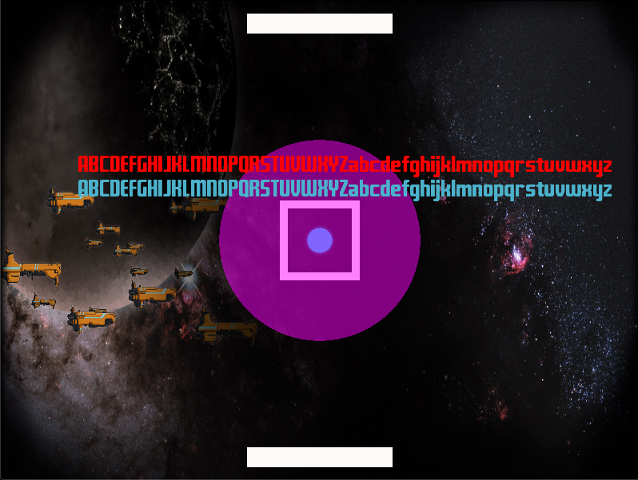

# ModernOpenGL

ModernOpenGL is educative cross platform project aims to demonstrate how to create Modern OpenGL basics, such as shaders, rendering textures, rendering texts
, and also batch rendering using `OpenGL`, `SDL2`, `glew`, `freetype` and `glm`.
Project consists of two parts, first part is base part which is responsible from batching and rendering data in main thread. Second part is
responsible from generating data handling user inputs in a different thread, we can consider this thread as a game thread. You can find the basic
usage of this project inside of `sandbox` folder.
This project has been tested successfully in `Macos Majove`, `Ubuntu 18.04` and `Windows 10`.
You can find detailed explanations in source.

## Building
ModernOpenGL uses `CMake` to build its source files. In order to build we need `OpenGL`, `SDL2`, `glew`, `freetype` and `glm`, since this project is
using `vcpkg` as a package manager all you need to do is checkout `vcpkg` from github and follow the instructions. It should take your 5 mins with a
mediocre internet connection. You can find the `vcpkg` link [here](https://github.com/microsoft/vcpkg). Once you are installed `vcpkg`, we have to define vcpkg
as a tool chain file which can be done like this.
```
-DCMAKE_TOOLCHAIN_FILE=[vcpkg root]/scripts/buildsystems/vcpkg.cmake ..
```
Also we have to give `vcpkg root` path into our `CMakeLists.txt`, since our cmake file is taking care of installing packages. In CMakeLists.txt you will see this line
```
-DVCPKG_ROOT=[vcpkg root]
```

On the whole our final build commands like this
In Unix
```
git clone https://github.com/erdinckaya/modernopengl && cd modernopengl
mkdir build && cd build
cmake -DCMAKE_TOOLCHAIN_FILE=[vcpkg root]/scripts/buildsystems/vcpkg.cmake -DVCPKG_ROOT=[vcpkg root] ..
make
./ModernOpenGL
```
In windows
```
git clone https://github.com/erdinckaya/modernopengl
cd modernopengl
mkdir build
cd build
cmake -DCMAKE_TOOLCHAIN_FILE=[vcpkg root]/scripts/buildsystems/vcpkg.cmake -DVCPKG_ROOT=[vcpkg root] ..
cmake --build . --target ModernOpenGL
mkdir resources
xcopy ..\resources resources\ /s/h/e/k/f/c/i
.\Debug\ModernOpenGL.exe
```
It is gonna download and install all packages according to your operating system.

## Usage
In `sandbox/main.cpp` you can find the exact details. In a nutshell
```
* Create window
* Prepare Resources
* Create Resources
* Bake render batches.
* Start Game thread and feed the rendering thread.
* Render all objects using batching.
```
You can find all detailed usages inside of sandbox folder.

Your design should look like this
```
int main(int argc, char *argv[]) {

  // Create configs and assets.
  constexpr unsigned int ScreenWidth = 800;
  constexpr unsigned int ScreenHeight = 600;
  // First create window by requesting from operating system.
  Window window(ScreenWidth, ScreenHeight, "Modern Opengl");
  // Create camera.
  Camera camera(glm::vec3(0.0f, 0.0f, 7.2f));
  ResourceManager &resourceManager = ResourceManager::instance();
  // Create OpenGL context and our renderer class. It takes camera and window. It uses window to bind opengl contex.
  Renderer renderer(window, camera);
  // Load our assets.
  resourceManager.LoadResources(Resources::GetTexturePaths(), Resources::GetShaderPaths(), Resources::GetFontPaths());
  // Prepare batches to render all render objects.
  renderer.CreateBatches();

  // When assets and window are ready Game can start.
  std::cout << "Main is ready" << std::endl;
  Game game(renderer);

  auto now = SDL_GetTicks() / 1000.0f;
  auto lastFrame = now;
  bool quit = false;
  while (!quit) {
    now = SDL_GetTicks() / 1000.0f;
    auto deltaTime = now - lastFrame;
    lastFrame = now;

    // Handles camera move.
    HandleCameraMove(camera, deltaTime);

    // Check SDL events.
    SDL_Event windowEvent;
    while (SDL_PollEvent(&windowEvent)) {
      switch (windowEvent.type) {
        case SDL_QUIT:quit = true;
          break;
        case SDL_KEYDOWN:
          if (windowEvent.key.keysym.sym == SDLK_ESCAPE) {
            quit = true;
          }
          break;
      }
    }

    // Render all objects.
    renderer.Draw();
  }

// End the game.
  game.Quit();
// Wait to deallocate resources.
  game.Join();

  return 0;
} 
```

### Rendering
This project handles rendering process in main thread and main reason is that, in mac you have to define your opengl context and
your window in same thread otherwise it will give you error, you can do opposite in windows but you are gonna need to deal with of pesky synchronization
problems. That is why project has two threads first one is rendering second one is game thread.
In `Renderer` class, it stores the `RenderData` and separates the data in terms of its batch type. Basically batch type is shader type in one difference
Text and Texture shaders are using  same batching which is TextureBatch, and other circle and rectangle shaders are using convex batching. Lets deep dive
into why we are doing this and what is batching.


Batching in a nutshell collecting same type of data and send all data in one draw call, which provides huge performance difference.
Lets examine the drawing process briefly.
```
* Create Vertex array object            // Keeps vertex array object
* Create Vertex buffer object           // Keeps our all data which is buffer data.
* Create Index buffer element object.   // Keeps the data of indexes of triangles that we are gonna draw.
* Bind the active texture               // Every graphics card supports different count of texture count. This basically loads our texture into active buffer to be rendered later. Unfortunately this part makes our batching a little bit tricky.
* Draw object. 
```
So in order to handle this tricky 4th rule we have to load textures before we draw objects as soon as we can, because every graphics card has limited
space for loading bunch of textures. Moreover we have to find a way to load our vertex buffer in efficient way we can do that using `glBufferSubData` instead of `glBufferData`.
Secondly we have to keep track of the textures order so that we can give them internal indexes which will be used in shader, since we are gonna define
textures as an array like this `uniform sampler2D textures[16];`. Moreover If we exceeded 16 texture limit we have to flush our batch to create new one.
You can register your texture in beginning like this
```
m_shader.Use();
const GLint sample_size = MaxTextureIndex;
for (int i = 0; i < sample_size; ++i) {
    m_shader.SetUniformInt("textures[" + std::to_string(i) + "]", i);
}
```
After that before we draw batches, we have to activate our textures.
```
m_shader.Use();
for (const auto &kv : m_textures) {
    glActiveTexture(GL_TEXTURE0 + kv.second);
    glBindTexture(GL_TEXTURE_2D, kv.first);
}
```
Note that we kept texture indexes in a unordered_map. There are fancy ways to activate bunch of textures in one function call, however most macos
distributions dont support high level of OpenGL, that is why I activated one by one.
So everything is done, we are ready to draw.

Another important thing is passing data to shaders. Normally you can do that by using shader program, however we are using batch rendering we want to
use shader only once and we are passing tons of vertex data which belong to different objects. Therefore we have to add our additional data into our
vertex buffer such as texture index, color, radius like that. In order to do that you can use mesh classes, all type of mesh classes supports this
feature. Please see `TextureMesh`, `TextMesh`, `RectangleMesh`, and `CircleMesh`.





At the end you should see basic pong screen.
